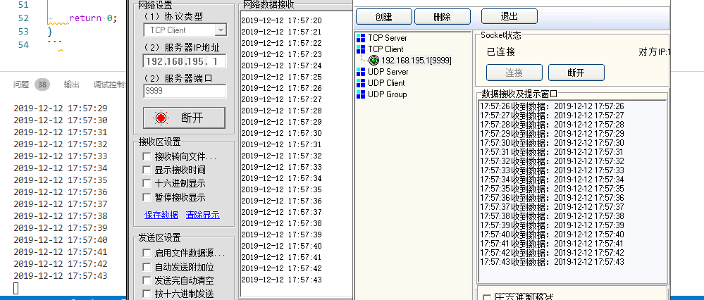

# stdoutdup

## 大致原理

1. 程序在指定端口（默认9999）等待TCP连接
2. 当有连接建立时，重定向标准输出至管道写端口
3. 在发数据线程中从管道的端口读取数据，转发给TCP连接者及原标准输出文件
4. TCP连接全部

## 功能特性

- 复制标准输出数据流，多TCP连接转发

## 注意

- 本模块当前依赖pthread库，win平台可能需要加入pthread库，或者使用win的线程API或C++11的多线程线程特性稍微修改即可

## 调用示例

```cpp
#include <iostream>
#include <time.h>
#include "duplog.h"

using namespace std;

void* testFunc(void *pParam)
{
	printf("%s\n", __FUNCTION__);
	char now[64] = {0};
	time_t t;

	while (1)
	{
		t = time(0);
		strftime(now, sizeof(now)-1, "%Y-%m-%d %H:%M:%S", localtime(&t));
		cout << now << endl;
		util::Sleep(1000);
	}
}

int main(int argc, char **argv)
{
	pthread_t id;
	pthread_create(&id, NULL, testFunc, NULL);
	CDupLog* ptmp = CDupLog::CreateDupLog();

	util::Sleep(60000);
	delete ptmp;
	ptmp = NULL;

	return 0;
}
```

## 效果

